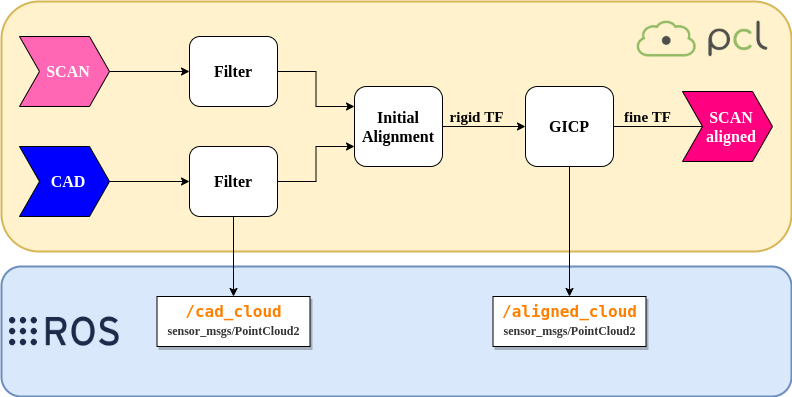
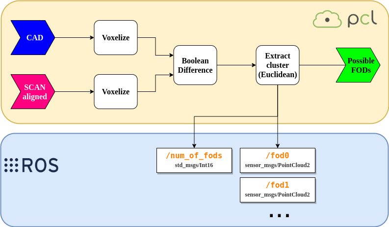

# LEICA POINT CLOUD PROCESSING #

# 1. Overview
In the aerospace industry, [FODs](https://www.fodcontrol.com/what-is-fod/) are a recurrent problem that implies a high risk. This package has been developed to help identifying FODs in aeronautical structures. 

Using point cloud analysis techniques, this software aims to compare the current state of the structure with its CAD to identify possible foreign objects. 

It has been designed to be used in combination with the *leica_scanstation* (link aqui) package, which allows to control the scanstation to make a scan of an aeronautical part. When the scan is finished, you get the point cloud that proceeds to be analyzed. 

# 2. Workflow

The aim is to compare two pointclouds: the one obtained after scanning with the Leica Scanstation, with the ideal one obtained directly from CAD. 
The first stage is to align both clouds by using algorithms such us [GICP](http://docs.ros.org/hydro/api/pcl/html/classpcl_1_1GeneralizedIterativeClosestPoint.html#details). 

Then, comparation is done and the system returns point clouds that represent possible FODs. 

# 3. Getting started

This package have been designed to be used in combination with *leica_scanstation*, but it will run the same way with pointclouds from other sources. 

However, you will need *leica_scanstation_msgs* and *leica_scanstation_utils* packages from *leica_scanstation* to use this one. 

# 4. Usage

# 4.1. Publish clouds

**load_and_publish_clouds** node will load both scanned and CAD clouds into ROS environment. 

    rosrun leica_point_cloud_processing load_and_publish_clouds

Considerations:

- Make sure pointcloud files are on the correct folder, specified in ROS param server as `/pointcloud_folder` (default: package leica_scanstation_utils/pointclouds).

- Supported formats: `.obj` for CAD files and `.pcd` for scanned files. NOTE: both files *must* have the same name.

- Publisher starts when service `/publish_clouds` is called: automatically done by `leica_scanstation_ros_node` when scan is finished or manually by user:

        rosservice call /publish_clouds "file_name: '{file}'"

NOTE: both files *must* have the same name.

# 4.2. Start process

**node** is the main node that perform alignment and FOD detection. It opens subscribers to clouds topics and start process. 

    rosrun leica_point_cloud_processing node

- Once alignment process is finished we recomend to see results in RViz. It is possible to modify results doing more iterations of GICP algorithm:

        rosservice call /iterate_gicp
        rosservice call /undo_iteration

- When results are good enough, search for FODs:

        rosservice call /get_fods

- To restart the program with different pointclouds:

        rosservice call /stop_alignment

# 5. Code API
## 5.1. Topics
- `cad/cloud` (sensor_msgs/PointCloud2)

Point cloud created from loading Part's CAD.

- `scan/cloud` (sensor_msgs/PointCloud2)

Point cloud obtained from loading the result of a scanning process.

- `cad/cloud_filtered` (sensor_msgs/PointCloud2)

CAD Point cloud after downsampling.

- `scan/cloud_aligned` (sensor_msgs/PointCloud2)

Point cloud resulting of the aligned cloud.

- `num_of_fods` (std_msgs/Int16)

Number of FODs detected in cloud

- `fod0` (sensor_msgs/PointCloud2)
- `fod1` (sensor_msgs/PointCloud2)
- `fod2` (sensor_msgs/PointCloud2)

    ...

It will create a topic for each FOD detected.

## 5.2. Services
- `publish_clouds` (leica_scanstation_msgs/PointCloudFile)
        
Tell which pointcloud file to publish into ROS environment.

- `iterate_gicp` (std_srvs/Trigger)
        
Ask for GICP algorithm to do a new iteration of the aligment process.

- `undo_iteration` (std_srvs/Trigger)
        
Restore cloud previous to last iteration.

- `get_fods` (std_srvs/Trigger)

Start process to search for FODs.

- `stop_alignment` (std_srvs/SetBool)

Stop current alignment process and restart the program subscribing again to pointclouds.